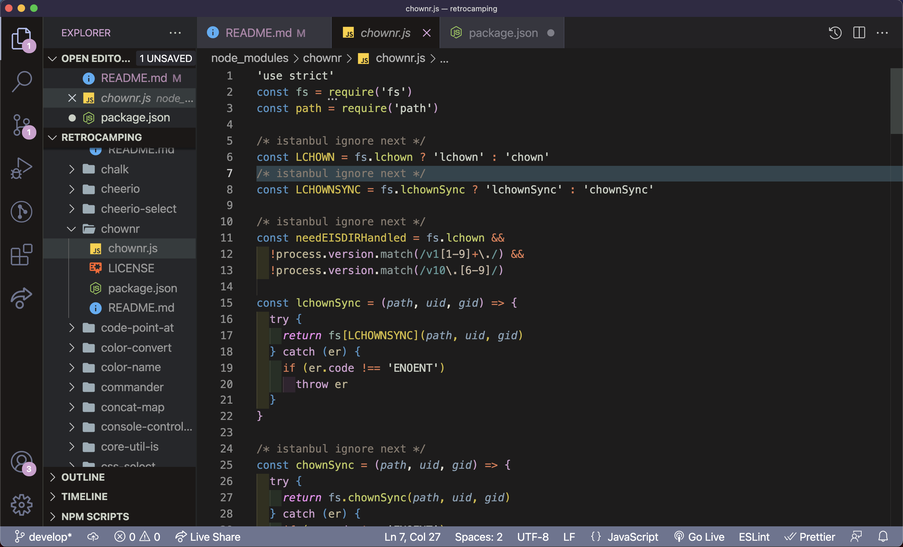
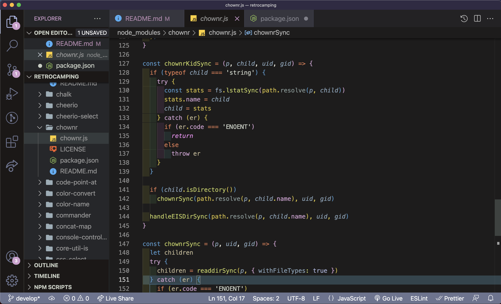
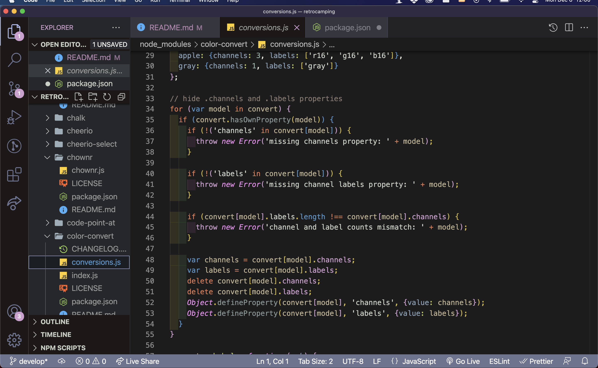
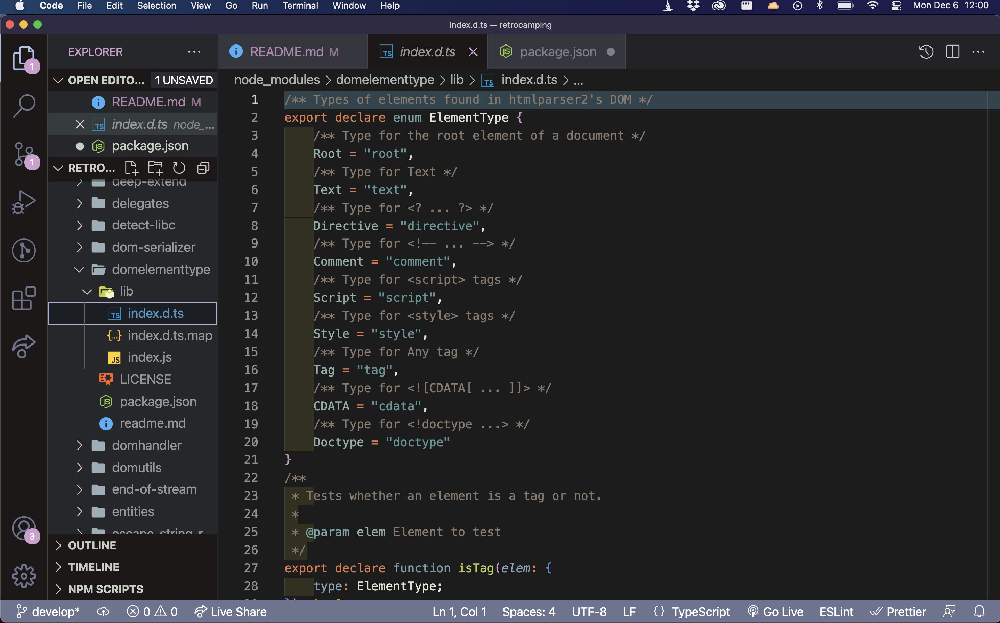

## About Retro Camping Theme
* Retro Camping theme is a color theme for vscode that Colors picked from retro camp badges.

* Supports Vue.js, React.
* Typescript support updates will be soon.

## How to Use
Open Command Palette (Cmmd+Shift+P), 
- Preferences: Color Theme
- Select 'Retro Camping' theme.