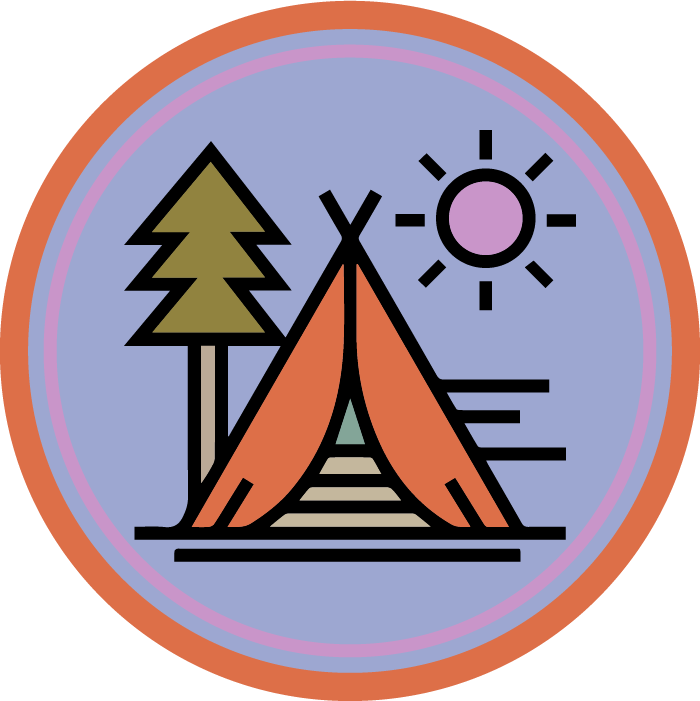

# Retro Color Theme
* Theme designed and made by Doyoon Lee

## About Retro Camping Theme
* Retro Camping theme is a dark color theme for vscode.
* Colors are inspired by retro camp badges.
---

* The theme is designed for Vue.js, React, javascript, typescript.

## How to Use
Open Command Palette (Cmmd+Shift+P), 
- Preferences: Color Theme
- Select 'Retro Camping' theme.

## See at MarketPlace

<a href="https://marketplace.visualstudio.com/items?itemName=DoyoonLee.retrocamping">
  
🏕 Retro Camping Theme at marketplace 

</a>
